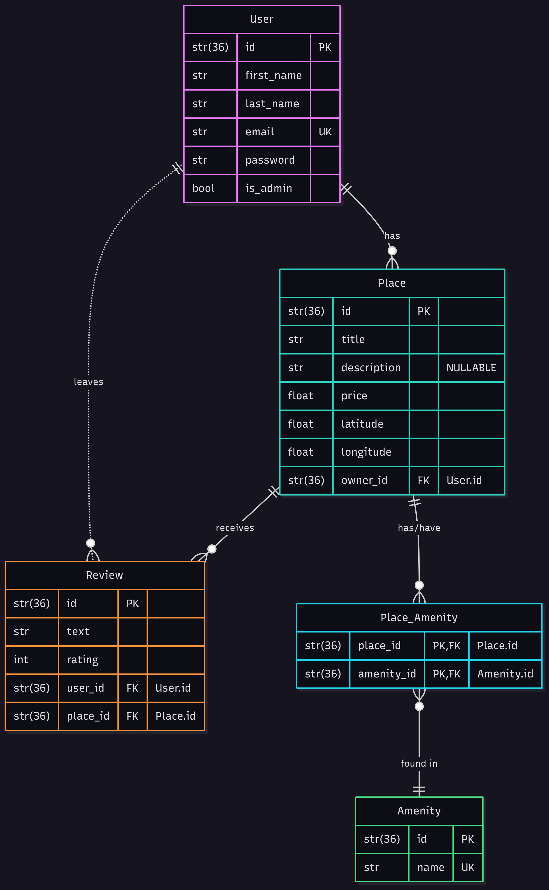
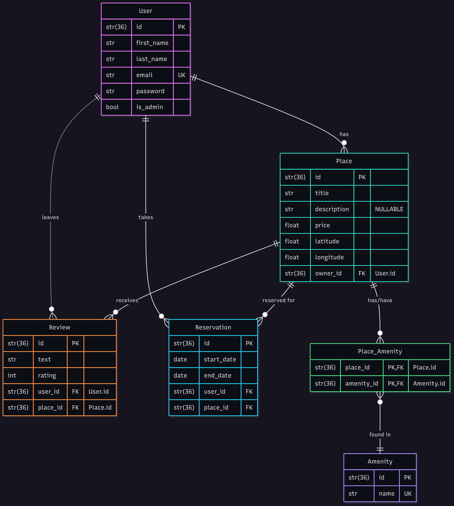

# HBNB Project - Partie 3 : Authentication and Data Persistence

## Table of Contents
- [Introduction](#introduction)
- [Objectives](#objectives)
- [Features](#features)
- [Structure](#structure)
- [Installation](#installation)
- [Endpoints](#api-endpoints)
- [Diagram](#er-diagram)
- [Authors](#authors)

### Introduction
This third phase of the HBnB project aims to transform the backend of the application by integrating essential functionalities for a production-ready application: user authentication, role-based authorization, and data persistence via a relational database.

We'll transition from in-memory storage to SQLite for development, with preparation for MySQL in production. This step is crucial for the application's security, scalability, and robustness.

### Objectives
The main objectives of this part of the project include:
- Authentication and Authorization (RBAC): Implement a JWT (JSON Web Tokens)-based authentication system using Flask-JWT-Extended, and role-based access control (is_admin) to restrict access to specific endpoints.

- Database Integration: Replace in-memory storage with a relational database. We'll use SQLite with SQLAlchemy (ORM) for development, and configure for MySQL in production.
Persistent CRUD Operations: Refactor all CRUD (Create, Read, Update, Delete) operations to interact directly with the database.

- Database Schema Design and Visualization: Design a robust database schema and visualize the relationships between entities (users, places, reviews, amenities) using mermaid.js.

- Data Consistency and Validation: Ensure that data validation and constraints are properly enforced at the database model level.

### Features
In addition to the functionalities from Part 2, this phase introduces:
- Secure User Authentication: User login via JWT, securing protected endpoints.
- Role-Based Access Control (RBAC): Differentiating permissions between regular users and administrators.
- Administrators can create/modify any user (including email/password), and manage all amenities.
- Administrators can bypass ownership restrictions to modify/delete any place or review.
- Data Persistence: Storing and retrieving data via a relational database (SQLite in dev, MySQL in prod).
Secure Password Handling: Hashing and verifying user passwords using bcrypt.
- ORM Models: Mapping entities (User, Place, Review, Amenity) to the database using SQLAlchemy.

### Structure
The project structure evolves to accommodate the new layers and functionalities:

```
hbnb/
├── app/
│   ├── __init__.py
│   ├── api/                            # Contains RESTful API definitions (Flask-RESTX)
│   │   ├── __init__.py
│   │   ├── v1/                         # API version 1
│   │       ├── __init__.py
│   │       ├── users.py
│   │       ├── places.py
│   │       ├── reviews.py
│   │       ├── amenities.py
|   |       |__ auth.py                 # New: Authentication endpoints (login)
|   |       |__ apiResources.py         # Containts functions to validate input datas
│   ├── models/                         # Defining object classes (User, Amenity, Place, Review)
│   │   ├── __init__.py
│   │   ├── user.py
│   │   ├── place.py
│   │   ├── review.py
│   │   ├── amenity.py
|   |   |__ baseEntity.py
│   ├── services/                       # Business logic layer / facade
│   │   ├── __init__.py
│   │   ├── facade.py
|   |   |__ AmenityService.py
|   |   |__ PlaceService.py
|   |   |__ ReviewService.py
|   |   |__ UserService.py
│   ├── persistence/                    # Persistence layer (InMemoryRepository)
│   |   ├── __init__.py
│   |   ├── repository.py               # Updated: interacts with DB instead of in-memory
|   |__ images
|   |   |__ ER Diagram.png              # Diagram illustrating the different relationships
|   |   |__ ER Diagram_extra.png        # Diagram illustrating the different relationships with an extra table
|   |__ tests                           # Folder for different tests
|       |__ scripts
|       |   |__ populate_data.sh
|       |   |__ tests_api.sh
|       |__testSQL
|       |   |__ test_sql_crud.sql       # Tests of CRUD operations
|       |__ test_amenity.py
|       |__ test_relationships.py
|       |__ test_reviews.py
|       |__ test_user.py
├── run.py                              # Flask application entry point
├── config.py
├── requirements.txt
|__ create_tables.sql                   # Create a DB with some elements
├── README.md

```

### Installation
#### 0. Install python 3.10.12 and sqlite 3.37.2
#### 1. Clone the repository
```
git clone https://github.com/Delphes1980/holbertonschool-hbnb.git desired_folder_name
```
then
```
cd desired_folder_name/part3/hbnb/
```

#### 2. Create and activate a virtual environment
```
python3 -m venv venv
```
then
```
source venv/bin/activate
```

#### 3. Install dependencies
```
pip install -r requirements.txt
```

#### 4. Initialize the database
On your terminal, type down the following command:
```
mkdir instance; sqlite3 instance/development.db < create_tables.sql
```

#### 5. Application utilisation
From the hbnb directory (within part3), run:
```
python run.py
```
The API will be available at http://127.0.0.1:5000/api/v1.

### API Endpoints
Here's a detailed list of the available API endpoints, noting changes regarding authentication and access restrictions.

* **Authentication (/auth)**
    * `POST /api/v1/auth/login`: Authenticates a user and returns a JWT access token.
        * **Payload Ex:** `{"email": "user@example.com", "password": "your_password"}`
        * **Success Response:** `200 OK, {"access_token": "your_jwt_token"}`

* **Users (/users)**
    * `POST /api/v1/users:` Creates a new user.
        `Requires:` Admin privileges.
        * **Payload Ex:** `{"email": "new@example.com", "password": "secure_password", "first_name": "New", "last_name": "User"}`
    * `GET /api/v1/users:` Retrieves all users. Public access.
    * `GET /api/v1/users/<user_id>:` Retrieves a user by ID. Public access.
    * `PUT /api/v1/users/<user_id>:` Updates a user's details.
        `Requires:` Authenticated user.
        `Restrictions:` Non-admins can only update their own details (excluding email and password). Admins can update any user's details (including email and password).
        * **Payload Ex:** `{"first_name": "Jane"} (regular user); {"email": "updated@example.com", "password": "new_pass"} (admin)`

* **Amenities (/amenities)**
    * `POST /api/v1/amenities:` Creates a new amenity.
        `Requires:` Admin privileges.
        * **Payload Ex:** `{"name": "Wi-Fi"}`
    * `GET /api/v1/amenities:` Retrieves all amenities. Public access.
    * `GET /api/v1/amenities/<amenity_id>:` Retrieves an amenity by ID. Public access.
    `PUT /api/v1/amenities/<amenity_id}:` Updates an amenity.
        `Requires:` Admin privileges.
        * **Payload Ex:** `{"name": "Pool"}`

* **Places (/places)**
    * `POST /api/v1/places:` Creates a new place.
        `Requires:` Authenticated user. owner_id is automatically set to the authenticated user's ID.
        * **Payload Ex:** `{"title": "Cozy Apartment", "description": "A lovely place...", "price": 100, "latitude": 48.85, "longitude": 2.35}`
    * `GET /api/v1/places:` Retrieves all places. Public access.
    * `GET /api/v1/places/<place_id>:` Retrieves a place by ID. Public access.
    * `PUT /api/v1/places/<place_id>:` Updates a place.
        `Requires:` Authenticated user.
        `Restrictions:` Regular users can only modify places they own. Admins can modify any place.
        * **Payload Ex (to add/modify amenities):** `{"amenities": ["UUID_AMENITY_1", "UUID_AMENITY_2"]}`
        `Note:` The amenities list is an array of UUIDs of existing amenities.

* **Reviews (/reviews)**
    * `POST /api/v1/reviews:` Creates a review for a specific place.
        `Requires:` Authenticated user. user_id is automatically set to the authenticated user's ID.
        `Restrictions:` Users cannot review their own place, and can only create one review per place.
        * **Payload Ex:** `{"place_id": "UUID_PLACE", "text": "Very pleasant stay.", "rating": 5}`
    * `GET /api/v1/reviews:` Retrieves all reviews. Public access.
    * `GET /api/v1/reviews/<review_id>:` Retrieves a review by ID. Public access.
    * `PUT /api/v1/reviews/<review_id>:` Updates a review.
        `Requires:` Authenticated user.
        `Restrictions:` Regular users can only modify reviews they created. Admins can modify any review.
        * **Payload Ex:** `{"rating": 4}`
    * `DELETE /api/v1/reviews/<review_id>:` Deletes a review.
        `Requires:` Authenticated user.
        `Restrictions:` Regular users can only delete reviews they created. Admins can delete any review.

### ER Diagram

The ER diagram for the HBnB Evolution application:


An ER diagram for HBnB Evolution with a yet-to-implement entity "Reservation"


### Authors
- [Delphine Coutouly-Laborda](https://github.com/Delphes1980)
- [Xavier Laforgue](https://github.com/XavierLaforgue)
