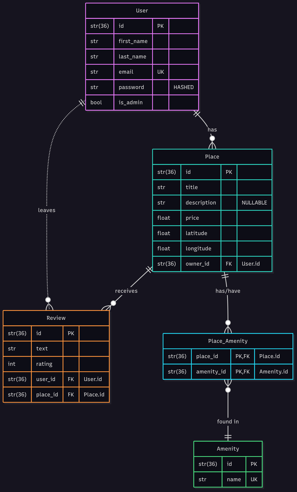

# HBnB Evolution #
Business Logic implementation

Brief overview of the project setup:

Description of the purpose of each directory and file.


Instructions on how to install dependencies and run the
application.

Install all dependncies with:
```
pip install -r requirements.txt
```

Run the application executing:
```
python3 run.py
```

## Business Logic layer ##

Description of the entities and their responsibilities.

Examples of how the classes and methods can be used.

## ER diagram



<!-- ```mermaid
erDiagram
    User ||--o{ Place : has
    User ||..o{ Review : leaves
    Place ||--o{ Place_Amenity : "has/have"
    Place_Amenity }o--|| Amenity : "found in"
    Place ||--o{ Review : receives
User {
    str(36) id PK
    str first_name
    str last_name
    str email UK
    str password "HASHED"
    bool is_admin
}
Place {
    str(36) id PK
    str title
    str description "NULLABLE"
    float price
    float latitude
    float longitude
    str(36) owner_id FK "User.id"
}
Review {
    str(36) id PK
    str text
    int rating
    str(36) user_id FK "User.id"
    str(36) place_id FK "Place.id"
}
Amenity {
    str(36) id PK
    str name UK
}
Place_Amenity {
    str(36) place_id PK,FK "Place.id"
    str(36) amenity_id PK,FK "Amenity.id"
}
``` -->
