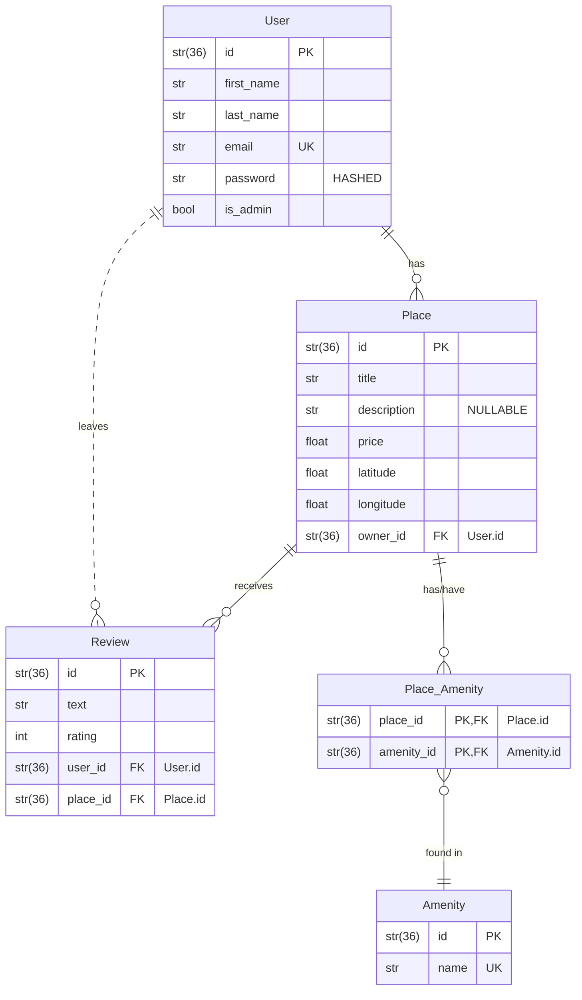

# HBnB Evolution #
Business Logic implementation

Brief overview of the project setup:

Description of the purpose of each directory and file.


Instructions on how to install dependencies and run the
application.

Install all dependncies with:
```
pip install -r requirements.txt
```

Run the application executing:
```
python3 run.py
```

## Business Logic layer ##

Description of the entities and their responsibilities.

Examples of how the classes and methods can be used.

## ER diagram

[](https://mermaid.live/edit#pako:eNqVVF2P2jAQ_CuWn1opSUmOr-SNHledBD2hVryUVMiNN2CdY0eOc8AB_72OQyBpK1XkwdGuZ2fG9tpHnEgKOMKgpoxsFMligcy3LECh08l15REtOEkARWhLis6k55nJb_DGYGdmOZA3uADqinb5epKBYPpggDE2RJ-2Bh3jFvyKOEvXPZ1QuyCVpaCIiU5Bw391oCABZj1UBlfV8DOKolQK_chJUbyQDNCxZii0-vAw_IgYRYvZNYVSpgq9FgZ4y5nSP1OQEcbRslWYG_6dVNSYfZ58f36aNlZ_SckRK9aEZsa_OMfCml_Z8V57mmneskGhSBTLNZPC6L4s5_PJ5_lTo5xySTTKFUugneDEsJS0m5Ni00o26nInQK2Nhy8zw1_tp8doRW9WUe_6qv7dvQ7Y6zpiQiNlHIlNt6As_q3cxuS2bRqQ3dCbv0v7rC7_ex1W520PuDmwpj1Xnei_tFePi5nzl802kNSEbehF47ampFKZQmoOPiUl16grXUVuwd4h8oNcYwdvFKM40qoEB2egTNOaEFuHMebkIEsd4-p-AX-NsVPn9RZMq9u0AlruXUrUq5tILpW1YXhzIn5ImTXUSpabLY5SwgsTlTklGi6PyRUCgoJ6NNdY4ygYWgocHfEeR74_9IJeLxz6g2oM-30HH3Dk-j3vYRj4_VE4HPnhOOiPzg5-t7K-FwzG4Xgw8MN-L_RH4cjBQJmW6mv9mNk37fwbUT2TUg)



